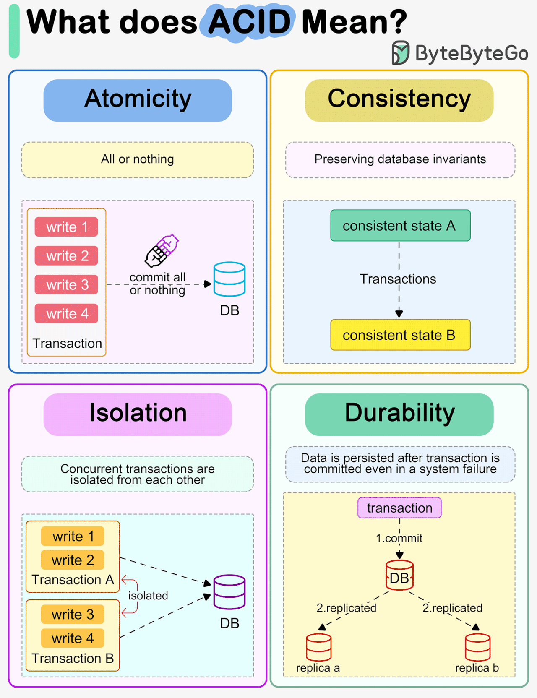
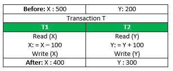

# Relational Database

- [My MySQL playlist](https://www.youtube.com/playlist?list=PLgH5QX0i9K3qLcx9DvVDWmNJ7riPvxzCD)
- [PSQL Tutorial](https://www.postgresqltutorial.com/)

## Table of Contents

1. [Introduction to Database](#1-introduction-to-database)
2. [Relational Database](#2-relational-database)
3. [Postgres, pgAdmin Installation and Basic Commands](#3-postgres-pgadmin-installation-and-basic-commands)
4. [Query and SQL](#4-query-and-sql)
5. [DDL - CREATE, DROP, RENAME Database & TABLE](#5-ddl---create-drop-rename-database--table)
6. [DML - INSERT RECORDS](#6-dml---insert-records)
7. [DML - INSERT RECORDS](#6-dml---insert-records)
8. [DML - INSERT RECORDS](#6-dml---insert-records)

## 1. introduction to Database

PostgresSQL is the most advanced open source Database Management System.

### Some important terms realted SQL

- Data: unorganized & meaningless facts are known as data. example - anis, 101, 3.45, name, gpa, roll
- Information: organized, process & meaningful facts are known as Information.
- Database: An organized collection of related Data table or files for accessign and manipulating Data. Example: college db can have student, teacher table etc.
- Database Management System (DBMS) : Databases are managed by Database Management Systems (DBMS), which allow users to create, read, update, and delete data efficiently.
- SQL: Structured Query Language for making and processing requests to Database.

### Advantages & Disadvantages of Database

- Advantages: faster presentation, easily accessible, update is easy, easily storable
- Disadvantage: security issue, required skill to handle database

### Types of Database

- Relational database: Relational Databases (SQL): Store data in tables with predefined schemas. Ideal for transactions and data integrity. Examples: MySQL, PostgresSQL, Oracle. You need ACID (Atomicity, Consistency, Isolation, Durability) compliance to ensure reliable transactions, which is critical for applications where data integrity and consistency are paramount.
Example: E-commerce transactions, banking, and financial systems.

Usecase:
E-commerce platforms (order processing, customer management).
Financial applications (banking, trading systems).
Content management systems (blog platforms, CMS).
Enterprise resource planning (ERP) systems.

- NoSQL Database: Schema less, Handle unstructured or semi-structured data, offering flexibility and scalability. Example: MongoDB, DynamoDB.
Usecase:

- Choosing Relational vs NoSQL

Choose Relational Databases When:
Data integrity and consistency are critical.
You need complex queries and relationships.
You require multi-step transactions.
The schema is stable and not expected to change often.

Choose NoSQL Databases When:
You need high scalability and distributed data across servers.
Data is unstructured, semi-structured, or rapidly evolving.
Performance, speed, and low latency are top priorities.
Your application handles big data or real-time analytics.

- 3 important elements of RD: field=col, key-field, record=row, value
- field vs record

## 2. Relational Database

### 2.1 Transaction and ACID Properties

- A transaction in a database is a sequence of one or more operations performed as a single logical unit of work. These operations are executed together to accomplish a specific task, and they must adhere to the ACID principles (Atomicity, Consistency, Isolation, Durability) to ensure data integrity and reliability.



**ACID** is an acronym that stands for **Atomicity, Consistency, Isolation,** and **Durability**. These principles are crucial for maintaining the reliability, accuracy, and integrity of data in databases, especially in systems that handle multiple transactions.

Let’s explore each ACID principle with an easy-to-understand example of a simple bank transfer scenario:

#### **Scenario: Bank Transfer Example**

Imagine you are transferring $100 from your **Savings Account** to your **Checking Account** using an online banking system. This operation involves two main steps:

1. **Deduct $100 from the Savings Account.**
2. **Add $100 to the Checking Account.**

To ensure that this transaction is handled correctly, the database needs to adhere to the ACID principles:

#### **1. Atomicity**

**Definition:**  
Atomicity ensures that all parts of a transaction are completed successfully or none of them are. If any part of the transaction fails, the entire transaction is rolled back, and the system returns to its previous state.



**Example:**

- In our bank transfer example, both steps (deducting from the savings account and adding to the checking account) must either both happen or not happen at all.
- **If Atomicity is maintained:** If the system crashes after deducting $100 from the savings account but before adding it to the checking account, the entire transaction will be rolled back, and no money will be deducted or added.
- **Without Atomicity:** You could end up with $100 missing from your savings without it being added to your checking, leading to data inconsistency.

#### **2. Consistency**

**Definition:**  
Consistency ensures that a transaction takes the database from one valid state to another, adhering to all predefined rules and constraints.

**Example:**

- The rule here is that the total amount of money across both accounts must remain the same before and after the transaction.
- Another rule: user account balance can not be negative.
- Another rule: not allowing overdraw.
- **If Consistency is maintained:** After the transfer, the combined balance of both accounts should still equal the original total amount (no money is created or lost).
- **Without Consistency:** The accounts might show an incorrect balance, such as money disappearing or being duplicated, violating the bank’s rules.

#### **3. Isolation**

**Definition:**  
Isolation ensures that multiple transactions occurring at the same time do not affect each other’s execution. Each transaction should act as if it is the only one being processed.

**Example:**

- Imagine that while you’re transferring $100, someone else is also transferring money between accounts.
- **If Isolation is maintained:** Your transfer of $100 will occur independently of the other transaction. Even if multiple transfers are happening simultaneously, each will be isolated, preventing any overlap or interference.
- **Without Isolation:** If isolation is not maintained, you could encounter problems like one transaction overwriting the changes of another, resulting in incorrect balances.

#### **4. Durability**

**Definition:**  
Durability ensures that once a transaction is committed, it is permanently recorded in the database, even in the case of a power failure, crash, or other disasters.

**Example:**

- After your $100 transfer is completed, the changes are saved permanently.
- **If Durability is maintained:** Even if there’s a sudden power outage right after your transaction completes, the transfer will not be lost; it’s saved securely in the database.
- **Without Durability:** A completed transaction might be lost due to unforeseen system failures, leading to missing records or incomplete data.

#### **Putting It All Together:**

When you initiate a transfer of $100 between your accounts, ACID principles ensure:

- **Atomicity**: Both deduction and addition happen, or neither happens.
- **Consistency**: The total money across accounts remains accurate.
- **Isolation**: Other simultaneous transfers won’t interfere with your transaction.
- **Durability**: Once completed, your transfer is saved permanently, even if there’s a system crash.

#### **Conclusion**

ACID principles are critical for ensuring reliable and consistent database operations, especially in systems where transactions must be processed accurately and safely, such as financial systems, booking platforms, and inventory management. By adhering to ACID, databases protect data integrity and provide a reliable user experience, even in complex and high-stakes environments.

### 2.2 Types of Key

- Primary key: unique key. in a table you will have one primary key.
- foreign key: one table's primary key - same other's table general key(foreign key). It is used to make relation between tables. In one table there can be multiple foreign keys.
- composite key: when you need to use 2 or more keys to identify a record
- Priamry key vs Foreign key

In a relational database, **keys** are crucial for organizing and managing data. They help ensure data integrity and establish relationships between different tables. In the context of an e-commerce database, different types of keys can be used to uniquely identify records, establish connections between tables, and enforce rules.

########### **Types of Keys in a Relational Database:**

1. **Primary Key**
2. **Foreign Key**
3. **Composite Key**
4. **Unique Key**
5. **Candidate Key**
6. **Alternate Key**

Let's explore each type of key with examples relevant to an e-commerce database:

########### **1. Primary Key**

**Definition:**  
A **primary key** is a unique identifier for a record in a table. It ensures that each record in the table is unique and can be referenced unambiguously.

**Example:**

- **Table: Customers**
  - `CustomerID` (Primary Key): Uniquely identifies each customer in the database.
  
- **Table: Products**
  - `ProductID` (Primary Key): Uniquely identifies each product in the catalog.

```sql
CREATE TABLE Customers (
    CustomerID INT PRIMARY KEY,
    Name VARCHAR(255),
    Email VARCHAR(255)
);

CREATE TABLE Products (
    ProductID INT PRIMARY KEY,
    ProductName VARCHAR(255),
    Price DECIMAL(10, 2)
);
```

########### **2. Foreign Key**

**Definition:**  
A **foreign key** is a field (or collection of fields) in one table that uniquely identifies a row in another table. It creates a relationship between the two tables, enforcing referential integrity.

**Example:**

- **Table: Orders**
  - `OrderID` (Primary Key)
  - `CustomerID` (Foreign Key referencing Customers table): Links each order to the corresponding customer.

```sql
CREATE TABLE Orders (
    OrderID INT PRIMARY KEY,
    OrderDate DATE,
    CustomerID INT,
    FOREIGN KEY (CustomerID) REFERENCES Customers(CustomerID)
);
```

########## **3. Composite Key**

**Definition:**  
A **composite key** is a primary key that consists of two or more columns used together to uniquely identify a record in a table.

**Example:**

- **Table: OrderDetails**
  - `OrderID` + `ProductID` (Composite Key): Together, these two fields uniquely identify each line item in an order.

```sql
CREATE TABLE OrderDetails (
    OrderID INT,
    ProductID INT,
    Quantity INT,
    PRIMARY KEY (OrderID, ProductID),
    FOREIGN KEY (OrderID) REFERENCES Orders(OrderID),
    FOREIGN KEY (ProductID) REFERENCES Products(ProductID)
);
```

######### **4. Unique Key**

**Definition:**  
A **unique key** ensures that all values in a column or a group of columns are unique across the entire table. Unlike primary keys, a table can have multiple unique keys, and they can accept a null value (but only one null if it's a single column unique key).

**Example:**

- **Table: Customers**
  - `Email` (Unique Key): Ensures that no two customers can have the same email address.

```sql
CREATE TABLE Customers (
    CustomerID INT PRIMARY KEY,
    Name VARCHAR(255),
    Email VARCHAR(255) UNIQUE
);
```

######## **5. Candidate Key**

**Definition:**  
A **candidate key** is a column, or a set of columns, that can uniquely identify any database record without referring to any other data. Every table can have one or more candidate keys, and out of these, one is selected as the primary key.

**Example:**

- **Table: Customers**
  - Both `CustomerID` and `Email` could be candidate keys, but typically, one (e.g., `CustomerID`) is chosen as the primary key.

####### **6. Alternate Key**

**Definition:**  
An **alternate key** is any candidate key that is not chosen as the primary key. It is an alternative way of uniquely identifying rows in a table.

**Example:**

- **Table: Customers**
  - If `CustomerID` is chosen as the primary key, `Email` could be an alternate key.

###### **Practical Example in an E-commerce Database:**

```sql
CREATE TABLE Customers (
    CustomerID INT PRIMARY KEY,
    Name VARCHAR(255),
    Email VARCHAR(255) UNIQUE
);

CREATE TABLE Products (
    ProductID INT PRIMARY KEY,
    ProductName VARCHAR(255),
    Price DECIMAL(10, 2)
);

CREATE TABLE Orders (
    OrderID INT PRIMARY KEY,
    OrderDate DATE,
    CustomerID INT,
    FOREIGN KEY (CustomerID) REFERENCES Customers(CustomerID)
);

CREATE TABLE OrderDetails (
    OrderID INT,
    ProductID INT,
    Quantity INT,
    PRIMARY KEY (OrderID, ProductID),
    FOREIGN KEY (OrderID) REFERENCES Orders(OrderID),
    FOREIGN KEY (ProductID) REFERENCES Products(ProductID)
);
```

##### **Explanation:**

- **Customers Table**:
  - `CustomerID` is the primary key, ensuring each customer is unique.
  - `Email` is a unique key, preventing duplicate emails.

- **Products Table**:
  - `ProductID` is the primary key, uniquely identifying each product.

- **Orders Table**:
  - `OrderID` is the primary key, and `CustomerID` is a foreign key, linking each order to a specific customer.

- **OrderDetails Table**:
  - The composite key (`OrderID`, `ProductID`) ensures that each combination of order and product is unique within the table.
  - Foreign keys `OrderID` and `ProductID` link to the Orders and Products tables, respectively, establishing relationships.

#### **Summary:**

In an e-commerce database:

- **Primary keys** uniquely identify records.
- **Foreign keys** create relationships between tables, ensuring referential integrity.
- **Composite keys** can uniquely identify records based on multiple columns.
- **Unique keys** ensure that specific columns, like emails, contain unique values.
- **Candidate keys** are potential primary keys, and the one not chosen is an **alternate key**.

Using these keys effectively helps maintain a well-organized, reliable, and scalable database structure for an e-commerce application.

### 2.3 ER Model

### **What is an ER Model (Entity-Relationship Model)?**

The **Entity-Relationship (ER) Model** is a high-level data modeling technique used to visually represent the structure of a database. It helps in designing databases by depicting entities (objects) and the relationships between them. The ER Model provides a clear, graphical way to organize data, making it easier to understand how different data elements relate to each other within a system.

### **Key Components of the ER Model:**

1. **Entities**
2. **Attributes**
3. **Relationships**
4. **Keys**
5. **ER Diagram (ERD)**

### **1. Entities**

**Definition:**  
An **entity** represents a real-world object or concept that is distinguishable from other objects. In the context of a database, entities are often modeled as tables.

**Examples:**

- **Customer**: Represents people who make purchases.
- **Product**: Represents items available for sale.
- **Order**: Represents transactions made by customers.

### **2. Attributes**

**Definition:**  
**Attributes** are properties or characteristics of an entity. In a table, attributes are represented as columns.

**Examples:**

- **Customer Entity**: Attributes might include `CustomerID`, `Name`, `Email`.
- **Product Entity**: Attributes might include `ProductID`, `ProductName`, `Price`.
- **Order Entity**: Attributes might include `OrderID`, `OrderDate`, `CustomerID`.

### **3. Relationships**

**Definition:**  
**Relationships** define how entities are connected to each other. They represent the logical association between entities.

**Types of Relationships:**

- **One-to-One (1:1)**: Each instance of an entity relates to exactly one instance of another entity.
- **One-to-Many (1:N)**: One instance of an entity relates to multiple instances of another entity.
- **Many-to-Many (M:N)**: Multiple instances of an entity relate to multiple instances of another entity.

**Example Relationships:**

- A **Customer** can place multiple **Orders** (One-to-Many).
- An **Order** can include multiple **Products** (Many-to-Many).

### **4. Keys**

**Definition:**  
**Keys** are attributes that uniquely identify entities and define relationships between entities.

- **Primary Key**: Uniquely identifies each record within an entity.
- **Foreign Key**: Establishes a link between two entities.

### **5. ER Diagram (ERD)**

**Definition:**  
An **Entity-Relationship Diagram (ERD)** is a visual representation of the ER Model. It uses shapes like rectangles, ovals, and diamonds to represent entities, attributes, and relationships.

**Components of an ER Diagram:**

- **Rectangles** represent entities.
- **Ovals** represent attributes.
- **Diamonds** represent relationships.
- **Lines** connect entities with their relationships and attributes.

### **Example ER Diagram for an E-commerce System:**

Let's look at a simple ER Diagram for an e-commerce system with three entities: **Customer**, **Order**, and **Product**.

```plaintext
+----------------+         +----------------+         +----------------+
|    Customer    |         |     Order      |         |    Product     |
+----------------+         +----------------+         +----------------+
| CustomerID (PK)|         |  OrderID (PK)  |         | ProductID (PK) |
| Name           |         |  OrderDate     |         | ProductName    |
| Email          |         |  CustomerID (FK)|        | Price          |
+----------------+         +----------------+         +----------------+
        |                         |                            |
        |   (places)              |  (contains)                |
        +-------------------------+----------------------------+
```

### **Explanation of the ER Diagram:**

- **Entities**: `Customer`, `Order`, and `Product`.
- **Attributes**: Each entity has attributes like `CustomerID`, `Name`, `Email` for Customer.
- **Relationships**:
  - **Customer to Order**: One-to-Many (`Customer` places multiple `Orders`).
  - **Order to Product**: Many-to-Many (`Order` can contain multiple `Products`).

### **Benefits of Using the ER Model:**

1. **Clarity and Visualization**: ER Diagrams provide a clear and visual representation of data, making it easy for stakeholders to understand the database structure.
2. **Design Blueprint**: Serves as a blueprint for designing and implementing a database.
3. **Identifies Relationships**: Helps identify relationships and dependencies between different entities, improving data organization.
4. **Improves Communication**: Enhances communication between database designers, developers, and business stakeholders by providing a common point of reference.
5. **Ensures Data Integrity**: Clearly defined relationships and constraints help maintain data integrity and reduce redundancy.

## 3. Postgres, pgAdmin Installation and Basic Commands

- [Download from here](https://www.postgresql.org/download/)
- GUI: [pgAdmin download](https://www.pgadmin.org/download/)
- CLI: SQL Shell (PSQL) setup
- using in terminal: psql + Enter or psql -u postgres; you may need to copy and set the path to the environment variables

### Basic commands for Postgres

- App <=> DBMS <=> Database
- DBMS - XAMPP (Cross platform Apache, MySQL, PHP Perl)
- first download and install the DBMS - [PostgreSQL](https://www.postgresql.org/download/)
- after downloading check the version: `psql -version`
- type `psql` in the command line
- some common commands for Postgres: These are just a few examples of psql commands. You can find more commands and options by typing `\?` in the psql command-line interface to display the help menu.

1. **Connect to a Database**: Connect to a specific database.

   ```bash
   \c dbname
   ```

   Replace `dbname` with the name of the database you want to connect to.

2. **List Databases**: List all databases on the server.

   ```bash
   \l
   ```

3. **List Tables**: List all tables in the current database.

   ```bash
   \dt
   ```

4. **Describe Table**: Display the structure of a specific table.

   ```bash
   \d table_name
   ```

   Replace `table_name` with the name of the table you want to describe.

5. **Quit psql**: Exit the psql command-line interface.

   ```bash
   \q
   ```

6. **Execute SQL File**: Execute SQL commands from a file.

   ```bash
   \i path/to/file.sql
   ```

   Replace `path/to/file.sql` with the path to your SQL file.

7. **Toggle Expanded Display**: Toggle expanded display mode (shows long lines as multiple lines).

   ```bash
   \x
   ```

8. **Show Version**: Display the version of PostgreSQL.

   ```bash
   SELECT version();
   ```

   or

   ```bash
   SELECT version;
   ```

9. **List Roles**: List all roles (users) on the server.

   ```bash
   \du
   ```

10. **Change Password**: Change the password for the current user.

    ```bash
    \password
    ```

### Database, Schema, Table

- Database => Schema => Table

## 4. Query and SQL

### Query

A query in the context of databases refers to a request for data or information from a database table or combination of tables. It is essentially a command that is written in a structured query language (SQL) or a similar language to retrieve specific information from a database. Query Language: QUEL, QBE, SQL (Structured Query Language)

Here are some common types of queries:

1. **SELECT Query**: The most commonly used type of query, the SELECT query retrieves data from one or more tables based on specified criteria. It can be used to fetch entire rows, specific columns, or calculated values.

   Example:

   ```sql
   SELECT * FROM customers;
   ```

2. **INSERT Query**: This type of query is used to add new records (rows) to a table.

   Example:

   ```sql
   INSERT INTO customers (name, email) VALUES ('John Doe', 'john@example.com');
   ```

3. **UPDATE Query**: An UPDATE query is used to modify existing records in a table.

   Example:

   ```sql
   UPDATE products SET price = 20.99 WHERE id = 123;
   ```

4. **DELETE Query**: DELETE queries are used to remove records from a table based on specified conditions.

   Example:

   ```sql
   DELETE FROM orders WHERE order_date < '2023-01-01';
   ```

5. **JOIN Query**: JOIN queries are used to combine rows from two or more tables based on related columns between them.

   Example:

   ```sql
   SELECT orders.order_id, customers.name
   FROM orders
   JOIN customers ON orders.customer_id = customers.customer_id;
   ```

6. **CREATE Query**: CREATE queries are used to create new database objects such as tables, indexes, or views.

   Example:

   ```sql
   CREATE TABLE employees (
       id INT PRIMARY KEY,
       name VARCHAR(100),
       department VARCHAR(100)
   );
   ```

7. **ALTER Query**: ALTER queries are used to modify the structure of existing database objects such as tables, indexes, or views.

   Example:

   ```sql
   ALTER TABLE employees ADD COLUMN salary DECIMAL(10, 2);
   ```

8. **DROP Query**: DROP queries are used to remove database objects such as tables, indexes, or views from the database.

   Example:

   ```sql
   DROP TABLE employees;
   ```

### SQL

- Features of SQL
  - Statements are not case sensitive (SELECT / select)
  - every statement mustbe end with semicolon
- SQL Statements types
  - **DML (DATA MANIPULATION LANGUAGE):** CRUD - SELECT, INSERT, UPDATE, DELETE
  - **DDL (DATA DEFINITION LANGUAGE):** CREATE, ALTER, DROP

### DDL (Data Definition Language)

- SHOW DATABASE;
- CREATE DATABASE college;
- DROP DATABASE college;
- CREATE, DROP, SHOW DATABASE

## 5. DDL - CREATE, DROP, RENAME Database & TABLE

- **commands are not case sensitive**
- help for psql commands `\?`
- List all the PSQL Database `\l` or in pgAdmin `SELECT datname FROM pg_database;`
- Create Database `CREATE DATABASE YourDatabaseName;` `CREATE DATABASE ecommerce`
- Connect to PSQL Database `\c databaseName`
- Drop Database `DROP DATABASE YourDatabaseName;`
- list all the tables: `\d tableName`

- syntax for creating table

```sql
-- Drop the existing order_products table for mysql
DROP TABLE IF EXISTS table_name;

CREATE TABLE table_name(
  col_name1 data_type(size),
  col_name2 data_type(size),
  PRIMARY KEY(col_name)
  ...
  );

-- Drop the existing order_products table for psql
DROP TABLE IF EXISTS table_name;

CREATE TABLE table_name(
  col_name1 data_type(size) PRIMARY KEY,
  col_name2 data_type(size),
  ...
  );
```

- RENAME TABLE old_table_name TO new_table_name; (mysql)
- ALTER TABLE current_table_name RENAME TO new_table_name; (psql)
- DROP TABLE table_name;

### Ecommerce Project: Create Tables

For an e-commerce application, you typically need CRUD operations for various entities such as users, products, orders, and categories. Here's an outline of the CRUD operations you might need for each entity:

1. **Users**:
   - Create: Register a new user.
   - Read: Retrieve user information by ID or username.
   - Update: Update user information (e.g., profile details, password).
   - Delete: Remove a user account.

2. **Products**:
   - Create: Add a new product to the catalog.
   - Read: Retrieve product information by ID, name, category, etc.
   - Update: Modify product details (e.g., name, price, description).
   - Delete: Remove a product from the catalog.

3. **Orders**:
   - Create: Place a new order for a user.
   - Read: Retrieve order information by ID, user, date, etc.
   - Update: Update order status (e.g., processing, shipped, delivered).
   - Delete: Cancel an order.

4. **Categories**:
   - Create: Create a new product category.
   - Read: Retrieve category information by ID or name.
   - Update: Modify category details (e.g., name, description).
   - Delete: Delete a category and optionally reassign products to another category.

These operations can be implemented using SQL queries or ORM (Object-Relational Mapping) frameworks depending on your technology stack. Additionally, you may need additional operations such as search, filtering, and pagination to enhance the functionality of your e-commerce application.

- here's an example of SQL commands to create tables for the entities mentioned:

- **Users**:

    ```sql
    <!-- for mysql  -->
    
    CREATE TABLE Users (
      userId SERIAL PRIMARY KEY,
      name VARCHAR(100) NOT NULL,
      email VARCHAR(100) UNIQUE NOT NULL,
      password VARCHAR(255) NOT NULL,
      address VARCHAR(255),
      image VARCHAR(255),
      isAdmin BOOLEAN DEFAULT FALSE,
      isBanned BOOLEAN DEFAULT FALSE,
      createdAt TIMESTAMP DEFAULT CURRENT_TIMESTAMP

    );


    ALTER TABLE users

    ADD COLUMN isAdmin BOOLEAN DEFAULT FALSE,
    ADD COLUMN isBanned BOOLEAN DEFAULT FALSE;

    ```

    ```sql
    <!-- for psql -->
    -- Drop the existing order_products table

   DROP TABLE IF EXISTS users;

   CREATE TABLE users (
      userId SERIAL PRIMARY KEY,
      name VARCHAR(100) NOT NULL,
      email VARCHAR(100) UNIQUE NOT NULL,
      password VARCHAR(255) NOT NULL,
      address VARCHAR(255),
      image VARCHAR(255),
      isAdmin BOOLEAN DEFAULT FALSE,
      isBanned BOOLEAN DEFAULT FALSE,
      createdAt TIMESTAMP DEFAULT CURRENT_TIMESTAMP
    );

    ```

  - SERIAL: In PostgreSQL, SERIAL is a pseudo data type that automatically generates a sequence of integers for each row inserted into the table. When you define a column as SERIAL, PostgreSQL will automatically create a sequence object and associate it with the column. This sequence generates unique integer values for the column whenever a new row is inserted into the table.

  - Image type: if you're storing the actual image files in the database, you might consider using a BYTEA (byte array) data type, which is suitable for storing binary data such as images. In some databases, there are specific data types designed for storing large binary objects (LOBs) like images, such as BLOB (Binary Large Object) in MySQL or BYTEA in PostgreSQL.

  - verify table creation: `\d tableName`
  
- **Using UUID (Universal Unique Identifier) / GUID (Globally Unique Identifier)**
    `userId UUID PRIMARY KEY DEFAULT uuid_generate_v4(),`

    ```sql
    <!-- for psql -->
    -- Drop the existing order_products table

   DROP TABLE IF EXISTS users;

   CREATE TABLE users (
      userId UUID PRIMARY KEY DEFAULT uuid_generate_v4(),
      name VARCHAR(100) NOT NULL,
      email VARCHAR(100) UNIQUE NOT NULL,
      password VARCHAR(255) NOT NULL,
      address VARCHAR(255),
      image VARCHAR(255),
      isAdmin BOOLEAN DEFAULT FALSE,
      isBanned BOOLEAN DEFAULT FALSE,
      createdAt TIMESTAMP DEFAULT CURRENT_TIMESTAMP
    );

    ```

    To ensure that the `uuid-ossp` extension is installed and enabled in your PostgreSQL database, you can follow these steps:

    1. Connect to your PostgreSQL database using a client tool or command-line interface that supports executing SQL commands.

    2. Check if the `uuid-ossp` extension is already installed by running the following SQL command:

    ```sql
    SELECT * FROM pg_extension WHERE extname = 'uuid-ossp';
    ```

    3. If the extension is not installed, you can install it by running the following SQL command:

    ```sql
    CREATE EXTENSION IF NOT EXISTS "uuid-ossp";
    ```

    This command will install the `uuid-ossp` extension if it's not already installed. If you encounter an error indicating that you don't have permission to create extensions, you may need to perform this action as a superuser or ask your database administrator for assistance.

    4. Once the extension is installed, you can enable it for your current database by running the following SQL command:

    ```sql
    CREATE EXTENSION IF NOT EXISTS "uuid-ossp" SCHEMA public;
    ```

    Replace `public` with the name of the schema where you want to enable the extension if you're using a different schema.

    5. After enabling the extension, you can verify that it's enabled by running the first SQL command again:

    ```sql
    SELECT * FROM pg_extension WHERE extname = 'uuid-ossp';
    ```

    You should see a row indicating that the `uuid-ossp` extension is now installed and enabled in your database.

- **Categories**:

    ```sql
    <!-- for mysql -->
    DROP TABLE IF EXISTS categories;
    CREATE TABLE categories (
        categoryID INT PRIMARY KEY AUTO_INCREMENT,
        name VARCHAR(100) UNIQUE NOT NULL,
        description TEXT
    );
    ```

    ```sql
    <!-- for psql -->
    DROP TABLE IF EXISTS categories;
    CREATE TABLE categories (
      categoryID SERIAL PRIMARY KEY,
      name VARCHAR(100) UNIQUE NOT NULL,
      slug VARCHAR(100) UNIQUE NOT NULL,
      description TEXT 
    );

    DROP TABLE IF EXISTS categories;
    CREATE TABLE categories (
      categoryId UUID PRIMARY KEY DEFAULT uuid_generate_v4(),
      name VARCHAR(100) UNIQUE NOT NULL,
      slug VARCHAR(100) UNIQUE NOT NULL,
      description TEXT 
    );
    ```

- **Products**:

    ```sql
    <!-- for mysql -->
    DROP TABLE IF EXISTS products;
    CREATE TABLE products (
        productID INT PRIMARY KEY AUTO_INCREMENT,
        name VARCHAR(255) NOT NULL,
        description TEXT,
        price DECIMAL(10, 2) NOT NULL,
        categoryID INT,
        FOREIGN KEY (CategoryID) REFERENCES Categories(CategoryID),
        createdAt DATETIME DEFAULT CURRENT_TIMESTAMP
    );
    ```

    ```sql
    <!-- for psql -->
    DROP TABLE IF EXISTS products;
    CREATE TABLE products (
        productID SERIAL PRIMARY KEY,
        name VARCHAR(255) NOT NULL,
        slug VARCHAR(255) NOT NULL,
        description TEXT,
        price DECIMAL(10, 2) NOT NULL,
        quantity INT DEFAULT 0,
        sold INT DEFAULT 0,
        image VARCHAR(255),
        shipping BOOLEAN,
        categoryID INT REFERENCES categories(categoryID), -- Combined with foreign key constraint
        createdAt TIMESTAMP DEFAULT CURRENT_TIMESTAMP
    );

    ```

    ```sql
    DROP TABLE IF EXISTS products;
    CREATE TABLE products (
        productId UUID PRIMARY KEY DEFAULT uuid_generate_v4(),
        name VARCHAR(255) NOT NULL,
        slug VARCHAR(255) NOT NULL,
        description TEXT,
        price DECIMAL(10, 2) NOT NULL,
        quantity INT DEFAULT 0,
        sold INT DEFAULT 0,
        image VARCHAR(255),
        shipping BOOLEAN,
        categoryID UUID REFERENCES categories(categoryID), -- Combined with foreign key constraint
        createdAt TIMESTAMP DEFAULT CURRENT_TIMESTAMP
    );
    ```

    - `DECIMAL(10, 2)`: This specifies the data type of the column. `DECIMAL` is a fixed-point number with a specified precision and scale. In this case, `(10, 2)` indicates that the column can store up to 10 digits in total, with 2 digits reserved for the fractional part (decimal places).
    - `NOT NULL`: This constraint ensures that the column cannot contain null values, meaning every row must have a valid price value.

    So, `Price DECIMAL(10, 2) NOT NULL` means that the `Price` column will store decimal numbers with up to 10 digits in total, where 2 digits are reserved for the fractional part (e.g., cents). Additionally, it ensures that the `Price` column cannot be null, meaning it must always contain a valid price value.

- **Orders**:

    ```sql
    CREATE TABLE orders (
        OrderID INT PRIMARY KEY AUTO_INCREMENT,
        UserID INT,
        OrderDate DATETIME DEFAULT CURRENT_TIMESTAMP,
        status VARCHAR(20) DEFAULT 'Pending',
        FOREIGN KEY (UserID) REFERENCES Users(UserID)
    );
    ```

   ```sql
    <!-- for psql -->
   -- Create the orders table (without junction table)

    CREATE TABLE orders (
        orderId UUID PRIMARY KEY DEFAULT uuid_generate_v4(),
        orderDate TIMESTAMP DEFAULT CURRENT_TIMESTAMP,
        status VARCHAR(20) DEFAULT 'Pending',
        <!-- userID INT REFERENCES Users(UserID), -->
        userID UUID REFERENCES Users(UserID),
        payment JSONB, -- Assuming payment details are stored as JSON
        productIDs UUID[], -- Array of product IDs
        createdAt TIMESTAMP DEFAULT CURRENT_TIMESTAMP
    );

    or 
     <!-- you can create your own type: `CREATE TYPE order_status AS ENUM ('Pending', 'Processing', 'Shipped', 'Delivered');` -->
    CREATE TYPE order_status AS ENUM ('Pending', 'Processing', 'Shipped', 'Delivered');
    CREATE TABLE orders (
      orderId SERIAL PRIMARY KEY,
      orderDate TIMESTAMP DEFAULT CURRENT_TIMESTAMP,
      status order_status DEFAULT 'Pending',
      payment JSONB,
      userId INT REFERENCES users(userId),
      products JSONB, -- denormalize the data and store product information directly   
      createdAt TIMESTAMP DEFAULT CURRENT_TIMESTAMP
    );

    -- with the junction table : normalize and no direct access to the table without foreign key
     CREATE TYPE order_status AS ENUM ('Pending', 'Processing', 'Shipped', 'Delivered');
     CREATE TABLE orders (
        orderId UUID PRIMARY KEY DEFAULT uuid_generate_v4(),
        orderDate TIMESTAMP DEFAULT CURRENT_TIMESTAMP,
        status order_status DEFAULT 'Pending',
        userID UUID REFERENCES users(userID)
    );


    -- Create the junction table

    CREATE TABLE order_products (
        orderID UUID REFERENCES orders(orderID),
        productID UUID REFERENCES products(productID),
        quantity INT,
        PRIMARY KEY (orderID, productID)
    );

    ```

- you can create your own type: `CREATE TYPE order_status AS ENUM ('Pending', 'Processing', 'Shipped', 'Delivered');`

### ALTER, ADD & DROP

- Add a new column to the table

```sql
ALTER TABLE TableName
ADD NewColumn DATA_TYPE(SIZE);

ALTER TABLE Students
ADD Hobby VARCHAR(100) DEFAULT 'Travelling';

ALTER TABLE Users
ADD COLUMN isAdmin BOOLEAN DEFAULT FALSE,
ADD COLUMN isBanned BOOLEAN DEFAULT FALSE;

```

- To delete a column or change the data type of a column from a table in SQL, you can use the `ALTER TABLE` statement with the `DROP COLUMN` clause. Here's the basic syntax:

```sql
ALTER TABLE table_name
DROP COLUMN column_name;

ALTER TABLE table_name
ALTER COLUMN column_name new_data_type;
```

Replace `table_name` with the name of your table and `column_name` with the name of the column you want to delete.

For example, if you want to delete a column named `email` from a table named `users`, you would execute:

```sql
ALTER TABLE users
DROP COLUMN email;

ALTER TABLE students
ALTER COLUMN age FLOAT;
```

Keep in mind that dropping a column will permanently remove it and all its data from the table, so be sure to use this operation carefully. Also, make sure to back up your data before performing any alterations to your database schema.

### Truncate Table

- Truncate table will not delete entire table just the records
`TRUNCATE TABLE student_details` vs `DROP TABLE student_details`

## 6. DML - INSERT RECORDS

- syntax for inserting records

  ```sql
  -- for instering one record
  INSERT INTO TABLE_NAME(COL1,COL2,...COLN)
  VALUES
  (VAL1, VAL2, ...VALN);

  -- for instering one record with shortcut
  INSERT INTO TABLE_NAME
  VALUES
  (VAL1, VAL2, ...VALN);

  -- for instering multiple records
  INSERT INTO TABLE_NAME
  VALUES
  (VAL1, VAL2, ...VALN),
  (VAL1, VAL2, ...VALN),
  ....
  (VAL1, VAL2, ...VALN);
  ```

### An example of SQL commands to insert data into the tables we created

- **Inserting data into the Users table**:

```sql

INSERT INTO users (name, email, password, address, image, isAdmin, isBanned)
VALUES 
  ('John Doe', 'john@example.com', 'password123', '123 Main St', 'profile.jpg', TRUE, FALSE),
  ('Alice Smith', 'alice@example.com', 'password456', '456 Elm St', 'avatar.png', FALSE, FALSE),
  ('Bob Johnson', 'bob@example.com', 'password789', '789 Oak St', NULL, FALSE, TRUE),
  ('Emily Davis', 'emily@example.com', 'passwordabc', NULL, 'default.jpg', FALSE, FALSE),
  ('Michael Brown', 'michael@example.com', 'passwordxyz', '567 Pine St', 'user.png', TRUE, FALSE);

-- or 
INSERT INTO users (name, email, password, address, image, isAdmin, isBanned,createdAt)
VALUES 
  ('John Doe', 'john@example.com', 'password123', '123 Main St', 'profile.jpg', TRUE, FALSE,CURRENT_TIMESTAMP),
```

- **Inserting data into the Categories table**:

```sql
  INSERT INTO categories (name, slug, description)
  VALUES 
  ('Electronics', 'electronics', 'Electronic devices and accessories'),
  ('Clothing', 'clothing', 'Apparel and fashion accessories'),
  ('Books', 'books', 'Fiction and non-fiction literature'),
  ('Home Decor', 'home-decor', 'Decorative items for the home'),
  ('Toys', 'toys', 'Children''s toys and games'); 
```

- **Inserting data into the Products table**:

```sql
INSERT INTO products (name, description, price, quantity, categoryID, createdAt)
VALUES
    ('Product 1 Name', 'Product 1 Description', 10.99, 100, 1, NOW()),
    ('Product 2 Name', 'Product 2 Description', 19.99, 50, 2, NOW()),
    -- Add more products here...
    ('Product 20 Name', 'Product 20 Description', 5.99, 200, 4, NOW());


  -- for serial data 
  INSERT INTO products (name, slug, description, price, quantity, sold, image, shipping, categoryID, createdAt)
VALUES 
  ('Laptop', 'laptop', 'High-performance laptop with SSD storage', 999.99, 50, 10, 'laptop.jpg', TRUE, 1, NOW()),
  ('Smartphone', 'smartphone', 'Latest smartphone model with 5G connectivity', 699.99, 100, 30, 'smartphone.jpg', TRUE, 1, NOW()),
  ('T-shirt', 't-shirt', 'Cotton t-shirt with trendy design', 19.99, 200, 80, 't-shirt.jpg', TRUE, 2, NOW()),
  ('Jeans', 'jeans', 'Denim jeans for casual wear', 39.99, 150, 60, 'jeans.jpg', TRUE, 2, NOW()),
  ('Novel', 'novel', 'Bestselling fiction novel', 12.99, 300, 120, 'novel.jpg', TRUE, 3, NOW()),
  ('Cookbook', 'cookbook', 'Collection of popular recipes', 24.99, 100, 40, 'cookbook.jpg', TRUE, 3, NOW()),
  ('Throw Pillow', 'throw-pillow', 'Decorative throw pillow for couch', 29.99, 50, 20, 'throw-pillow.jpg', TRUE, 4, NOW()),
  ('Wall Art', 'wall-art', 'Canvas wall art for home decor', 49.99, 80, 30, 'wall-art.jpg', TRUE, 4, NOW()),
  ('Action Figure', 'action-figure', 'Collectible action figure', 14.99, 120, 50, 'action-figure.jpg', TRUE, 5, NOW()),
  ('Board Game', 'board-game', 'Popular board game for family fun', 29.99, 70, 30, 'board-game.jpg', TRUE, 5, NOW()),
  ('Headphones', 'headphones', 'Wireless headphones with noise cancellation', 149.99, 90, 40, 'headphones.jpg', TRUE, 1, NOW()),
  ('Smart Watch', 'smart-watch', 'Fitness tracker smart watch', 199.99, 60, 20, 'smart-watch.jpg', TRUE, 1, NOW()),
  ('Dress', 'dress', 'Elegant dress for special occasions', 79.99, 80, 25, 'dress.jpg', TRUE, 2, NOW()),
  ('Sneakers', 'sneakers', 'Stylish sneakers for everyday wear', 59.99, 120, 45, 'sneakers.jpg', TRUE, 2, NOW()),
  ('Cooking Utensils Set', 'cooking-utensils-set', 'Complete set of kitchen utensils', 49.99, 100, 35, 'cooking-utensils-set.jpg', TRUE, 4, NOW());

  -- for uuid 
INSERT INTO products (name, slug, description, price, quantity, sold, image, shipping, categoryID, createdAt)
VALUES 
  ('Laptop', 'laptop', 'High-performance laptop with SSD storage', 999.99, 50, 10, 'laptop.jpg', TRUE, '1820433f-fd1a-44c7-a168-59dd34554ca5', NOW()),
  ('Smartphone', 'smartphone', 'Latest smartphone model with 5G connectivity', 699.99, 100, 30, 'smartphone.jpg', TRUE, '1820433f-fd1a-44c7-a168-59dd34554ca5', NOW()),
  ('T-shirt', 't-shirt', 'Cotton t-shirt with trendy design', 19.99, 200, 80, 't-shirt.jpg', TRUE, 'f9e6f058-6c69-4133-9638-352b2b312db8', NOW()),
  ('Jeans', 'jeans', 'Denim jeans for casual wear', 39.99, 150, 60, 'jeans.jpg', TRUE, 'f9e6f058-6c69-4133-9638-352b2b312db8', NOW()),
  ('Novel', 'novel', 'Bestselling fiction novel', 12.99, 300, 120, 'novel.jpg', TRUE, '1d2cab81-1424-4c14-acc5-6cdc0a2a096b', NOW()),
  ('Cookbook', 'cookbook', 'Collection of popular recipes', 24.99, 100, 40, 'cookbook.jpg', TRUE, '1d2cab81-1424-4c14-acc5-6cdc0a2a096b', NOW()),
  ('Throw Pillow', 'throw-pillow', 'Decorative throw pillow for couch', 29.99, 50, 20, 'throw-pillow.jpg', TRUE, 'c79a747b-7741-4b5b-904d-f7ac3a372613', NOW()),
  ('Wall Art', 'wall-art', 'Canvas wall art for home decor', 49.99, 80, 30, 'wall-art.jpg', TRUE, 'c79a747b-7741-4b5b-904d-f7ac3a372613', NOW()),
  ('Action Figure', 'action-figure', 'Collectible action figure', 14.99, 120, 50, 'action-figure.jpg', TRUE, 'd6e297d6-10bb-430a-a774-4d84297f4bcb', NOW()),
  ('Board Game', 'board-game', 'Popular board game for family fun', 29.99, 70, 30, 'board-game.jpg', TRUE, 'd6e297d6-10bb-430a-a774-4d84297f4bcb', NOW()),
  ('Headphones', 'headphones', 'Wireless headphones with noise cancellation', 149.99, 90, 40, 'headphones.jpg', TRUE, '1820433f-fd1a-44c7-a168-59dd34554ca5', NOW()),
  ('Smart Watch', 'smart-watch', 'Fitness tracker smart watch', 199.99, 60, 20, 'smart-watch.jpg', TRUE, '1820433f-fd1a-44c7-a168-59dd34554ca5', NOW()),
  ('Dress', 'dress', 'Elegant dress for special occasions', 79.99, 80, 25, 'dress.jpg', TRUE, 'f9e6f058-6c69-4133-9638-352b2b312db8', NOW()),
  ('Sneakers', 'sneakers', 'Stylish sneakers for everyday wear', 59.99, 120, 45, 'sneakers.jpg', TRUE, 'f9e6f058-6c69-4133-9638-352b2b312db8', NOW()),
  ('Cooking Utensils Set', 'cooking-utensils-set', 'Complete set of kitchen utensils', 49.99, 100, 35, 'cooking-utensils-set.jpg', TRUE, 'c79a747b-7741-4b5b-904d-f7ac3a372613', NOW());
```

- **Inserting data into the Orders table**:

```sql
-- without junction table:  denormalize the data and store product information directly   
INSERT INTO orders (orderDate, status, payment, userId, products)
VALUES
  ('2024-04-20 10:00:00', 'Pending', '{"method": "credit card", "amount": 100}', 1, '[{"product_id": 1, "quantity": 3}, {"product_id": 2, "quantity": 1}]'),
  ('2024-04-21 11:00:00', 'Processing', '{"method": "cash on delivery", "amount": 150}', 2, '[{"product_id": 3, "quantity": 2}]');

```

```sql
-- with junction table
-- Inserting a sample order with multiple products
INSERT INTO orders (orderDate, status, userID) VALUES (CURRENT_TIMESTAMP, 'Pending', 'f10b0683-6e0b-45a1-95a7-909a72aa1187');

-- Inserting products for the sample order
INSERT INTO order_products (orderID, productID, quantity) VALUES
    ('2bb5c629-c822-4b73-b75b-9fe11c39495e', '486103e3-4d54-4f0e-b91c-96561bc8f91b', 2),
    ('2bb5c629-c822-4b73-b75b-9fe11c39495e', '4897005c-ce5f-4af1-8e82-b2e2b54e8720', 1),('2bb5c629-c822-4b73-b75b-9fe11c39495e', 'c1ab6fbc-e4e5-4e5d-b75c-868c3baa28e9', 3);

-- another method
INSERT INTO order_products (orderID, productID, quantity)
SELECT '2bb5c629-c822-4b73-b75b-9fe11c39495e', 
       unnest(array['486103e3-4d54-4f0e-b91c-96561bc8f91b'::uuid, '4897005c-ce5f-4af1-8e82-b2e2b54e8720'::uuid, 'c1ab6fbc-e4e5-4e5d-b75c-868c3baa28e9'::uuid]),
       unnest(array[2, 1, 3]);

-- now select the products, user based on product id
  SELECT
      u.name AS user_name,
      u.email AS user_email,
      p.name AS product_name,
      p.price AS product_price,
      op.quantity AS product_quantity
  FROM
      orders o
  JOIN
      order_products op ON o.orderID = op.orderID
  JOIN
      users u ON o.userID = u.userID
  JOIN
      products p ON op.productID = p.productID
  WHERE
      o.orderID = '2bb5c629-c822-4b73-b75b-9fe11c39495e'; 

```

## 7. DML - FIND / SELECT RECORDS

- syntax for selecting records

```sql
  -- find all records with specific fields/columns
  SELECT COL1,COL2,...COLN
  FROM table_name
  -- find all records with all the fields/columns
  SELECT *
  FROM table_name;
```

```sql
SELECT 
  orderId,
  orderDate,
  status,
  payment,
  userId,
  products
FROM 
  orders
WHERE 
  orderId = 1;

If you want to extract specific information from the products JSONB array, such as the product_id and quantity, you can use JSON functions like jsonb_array_elements or jsonb_array_elements_text. Here's an example:
SELECT 
  orderId,
  orderDate,
  status,
  payment,
  userId,
  (jsonb_array_elements(products) ->> 'product_id')::int AS product_id,
  (jsonb_array_elements(products) ->> 'quantity')::int AS quantity
FROM 
  orders
WHERE 
  orderId = 1;
```

- To visualize a PostgreSQL table nicely in the terminal, you can use the `\x` command in `psql` to toggle expanded display mode.
  - Run the following command to enter expanded display mode `\x`

  - After enabling expanded display mode, run a query to select data from your table. For example: `SELECT * FROM your_table;`

  - To disable expanded display mode and return to the default display format, simply run: `\x`

## SELECT and WHERE Clause

To perform select operations in PostgreSQL, you can use the `SELECT` statement. Here's an example of how you can retrieve data from the `Users` table:

```sql
-- Retrieve all columns for all users
SELECT * FROM Users;

-- Retrieve specific columns for all users
SELECT UserID, Username, Email FROM Users;

-- Retrieve data based on a condition (e.g., where UserID equals 1)
SELECT * FROM Users WHERE UserID = 1;

-- Retrieve data based on multiple conditions
SELECT * FROM Users WHERE Username = 'username1' AND Email = 'user1@example.com';
```

Similarly, you can perform select operations on other tables like `Products`, `Categories`, and `Orders` using the same `SELECT` statement with appropriate column names and conditions. Here are some examples:

```sql
-- Retrieve all columns for all products
SELECT * FROM Products;

-- Retrieve products belonging to a specific category (e.g., where CategoryID equals 1)
SELECT * FROM Products WHERE CategoryID = 1;

-- Retrieve all columns for all categories
SELECT * FROM Categories;

-- Retrieve all columns for all orders
SELECT * FROM Orders;

-- Retrieve orders placed by a specific user (e.g., where UserID equals 1)
SELECT * FROM Orders WHERE UserID = 1;
```

You can customize the select queries based on your specific requirements and the structure of your database tables.

- where clause allows us to find records conditionally

```sql
SELECT COL1,COL2,...COLN
FROM table_name
WHERE codition;

example
SELECT Name
FROM students
WHERE city='Tampere';
```

## DISTINCT, LIMIT, ORDER BY

- distinct command for avoiding repeated values, limit can return limited records

```sql
SELECT DISTINCT COL1,COL2,...COLN
FROM table_name
LIMIT 5;

SELECT DISTINCT COL1,COL2,...COLN
FROM table_name
-- (start from record 3, how many records you want )
LIMIT 2,5;

-- ORDER BY helps us to sort
SELECT COL1,COL2,...COLN
FROM table_name
ORDER BY COL1, COL2,...COLN;

-- for descending ORDER BY helps us to sort
SELECT COL1,COL2,...COLN
FROM table_name
ORDER BY COL1, COL2,...COLN DESC ;
```

## 8. DML - UPDATE STATEMENT

```sql
UPDATE table_name
SET COL1=VAL1, COL2=VAL2, ...COLN=VALN
WHERE condition;

example1
UPDATE techers
SET salary=20000
WHERE ID=102;

example2
UPDATE techers
SET salary=salary+20000
WHERE salary>=10000;
```

Sure, here are examples of `UPDATE` and `DELETE` operations in PostgreSQL for the given tables:

**UPDATE operation:**

1. Update the email address of a user with a specific username:

```sql
UPDATE Users SET Email = 'new_email@example.com' WHERE Username = 'username1';
```

2. Update the status of an order with a specific OrderID:

```sql
UPDATE Orders SET Status = 'Shipped' WHERE OrderID = 123;
```

These examples illustrate how to use `UPDATE` and `DELETE` statements to modify or remove records from the tables in your PostgreSQL database.

## 9. DML - DELETE STATEMENT

```sql
DELETE FROM table_name
WHERE condition;

example
DELETE FROM techers
WHERE ID=102;
```

**DELETE operation:**

- Delete a user with a specific UserID:

```sql
DELETE FROM Users WHERE UserID = 1;
```

- Delete all orders placed by a user with a specific UserID:

```sql
DELETE FROM Orders WHERE UserID = 1;
```

## 10. Operators

- Arithmetic operators: + - \* / %
- Comparision or Relational operators > >= < <= = != BETWEEN
- Logical operators: AND OR NOT IN

## 11. RELATIONAL OPERTAORS IN SQL

- `SELECT * FROM Users WHERE CreatedAt > '2022-01-01';`

- BETWEEN

```sql
SELECT COL1,COL2,...COLN
FROM table_name
WHERE COL BETWEEN START_VALUE AND END_VALUE;

example
SELECT ID, NAME, GPA
FROM students
WHERE ID BETWEEN 101 AND 105;
```

## 12. LOGICAL OPERTAORS IN SQL

- OR, AND, NOT, IN, LIKE

```sql
SELECT COL1,COL2,...COLN
FROM table_name
WHERE FIELD_NAME=VALUE OR FIELD_NAME=VALUE ...;

SELECT COL1,COL2,...COLN
FROM table_name
WHERE FIELD_NAME=VALUE AND FIELD_NAME=VALUE ...;

SELECT *
FROM students
WHERE city='Tampere'
  OR city='Helsinki'
  OR city='Oulu'

SELECT *
FROM students
WHERE city IN ('Tampere','Helsinki','Oulu');

SELECT *
FROM students
WHERE city NOT IN ('Tampere','Helsinki','Oulu');

-- like helps to search based on a pattern
SELECT *
FROM students;
-- find anyone name starts with s
WHERE name LIKE 's%';
-- find anyone name ends with s
WHERE name LIKE '%s';
-- find anyone name contains hi
WHERE name LIKE '%hi%';
```

- Retrieve users with a username containing a specific substring:

```sql
SELECT * FROM Users WHERE Username LIKE '%part_of_username%';
```

- Retrieve users with a username starting with a specific letter:

```sql
SELECT * FROM Users WHERE Username LIKE 'A%';
```

- Retrieve users with a username ending with a specific letter:

```sql
SELECT * FROM Users WHERE Username LIKE '%a';
```

- Retrieve users with a username starting with a specific letter and having a certain length:

```sql
SELECT * FROM Users WHERE Username LIKE 'A%' AND LENGTH(Username) > 5;
```

- Retrieve users created after a specific date:

```sql
SELECT * FROM Users WHERE CreatedAt > '2022-01-01';
```

- Retrieve users created within a specific date range:

```sql
SELECT * FROM Users WHERE CreatedAt BETWEEN '2022-01-01' AND '2022-12-31';
```

- Select users whose full names are not null or addresses are not null:
`SELECT * FROM Users WHERE FullName IS NOT NULL OR Address IS NOT NULL;`

These examples demonstrate various ways you can use the `WHERE` clause to filter records based on different conditions in your PostgreSQL queries.

## 13. Custom name with AS Keyword

```sql
SELECT COL1 AS 'CUSTOM_NAME'
FROM table_name;


example1
SELECT Roll as 'student_id'
FROM students;

example1
SELECT Roll as id
FROM students;
```

`SELECT Email AS UserEmail FROM Users;`

## 14. SubQueries & [UPPER and LOWER Function](https://youtu.be/95wBGq9PJZQ)

- Sub Queries: Query inside query

```sql
SELECT * FROM Products
WHERE Price > (SELECT AVG(Price) FROM Products);
```

## 15. Constraint and AUTO_INCREMENT

- When creating table we can set constraint and auto increment
- Constraints: NOT NULL, UNIQUE, PRIMARY KEY = NOT NULL + UNIQUE, DEFAULT

```sql
CREATE TABLE TABLE_NAME N(
  ID int NOT NULL AUTO_INCREMENT,
  Name NOT NULL,
)
```

## 16. [Functions](https://youtu.be/hn6P4tBRaIE)

- Concatenating the username and email address:

```sql
SELECT CONCAT(Username, '@', Email) AS UserEmail FROM Users;
```

- Getting the length of the username:

```sql
SELECT Username, LENGTH(Username) AS UsernameLength FROM Users;
```

- Extracting the year from the created date:

```sql
SELECT Username, EXTRACT(YEAR FROM CreatedAt) AS CreatedYear FROM Users;
```

- Converting the username to uppercase:

```sql
SELECT UPPER(Username) AS UpperCaseUsername FROM Users;
```

- Converting the username to lowercase:

```sql
SELECT LOWER(Username) AS LowerCaseUsername FROM Users;
```

- The GREATEST and LEAST functions in SQL are typically used with numeric or date/time values.
Sure, let's consider a scenario where we want to find the user with the earliest registration date (`CreatedAt`) and the user with the latest registration date.

Here's how you can use the `LEAST` and `GREATEST` functions in SQL for the `Users` table:

```sql
-- Find the user with the earliest registration date
SELECT * FROM Users
WHERE CreatedAt = (SELECT LEAST(CreatedAt) FROM Users);

-- Find the user with the latest registration date
SELECT * FROM Users
WHERE CreatedAt = (SELECT GREATEST(CreatedAt) FROM Users);
```

In these queries:

- `LEAST(CreatedAt)` finds the minimum value of the `CreatedAt` column.
- `GREATEST(CreatedAt)` finds the maximum value of the `CreatedAt` column.
- We then use subqueries to select the user(s) whose `CreatedAt` matches the result of `LEAST` or `GREATEST`.

These queries will return the user(s) with the earliest and latest registration dates, respectively, from the `Users` table.

## 17. [Aggregate Functions](https://youtu.be/dO2h-s8tv2g)

- aggregate: one result in the end. AVG(), COUNT(), MAX(), MIN(), SUM()

```sql
-- Total number of users
SELECT COUNT(*) AS TotalUsers FROM Users;

-- Average age of users (assuming there's an Age column)
SELECT AVG(Age) AS AverageAge FROM Users;

-- Earliest registration date
SELECT MIN(CreatedAt) AS EarliestRegistrationDate FROM Users;

-- Latest registration date
SELECT MAX(CreatedAt) AS LatestRegistrationDate FROM Users;

-- Total number of products
SELECT COUNT(*) AS TotalProducts FROM Products;

-- Average price of products
SELECT AVG(Price) AS AveragePrice FROM Products;

-- Highest price of a product
SELECT MAX(Price) AS HighestPrice FROM Products;

-- Lowest price of a product
SELECT MIN(Price) AS LowestPrice FROM Products;

```

## 18. GroupBy

```sql
SELECT Country, COUNT(UserID) AS UserCount
FROM Users
GROUP BY Country;
```

## 19. Joining Tables

```sql
-- create student table 
CREATE TABLE Students (
    StudentId INT PRIMARY KEY,
    FirstName VARCHAR(50),
    LastName VARCHAR(50),
    Gender VARCHAR(50),
    DOB DATE,
    Age INT
);

INSERT INTO Students (StudentId, FirstName, LastName, Gender, DOB, Age) VALUES
(1, 'John', 'Doe', 'Male', '1995-05-15', 26),
(2, 'Jane', 'Smith', 'Female', '1998-08-20', 23),
(3, 'Michael', 'Johnson', 'Male', '1997-03-10', 24),
(4, 'Emily', 'Brown', 'Female', '1996-11-25', 25),
(5, 'David', 'Williams', 'Male', '1999-06-30', 22),
(6, 'Sarah', 'Jones', 'Female', '1994-09-05', 27),
(8, 'Christopher', 'Davis', 'Male', '2000-02-12', 21);


-- create Grade table 
CREATE TABLE Grades (
    GradeID INT PRIMARY KEY,
    StudentID INT,
    Course VARCHAR(50),
    Grade VARCHAR(2)
);

INSERT INTO Grades (GradeID, StudentID, Course, Grade)
VALUES
    (1, 1, 'Math', 'A'),
    (2, 1, 'Science', 'B'),
    (3, 2, 'Math', 'B+'),
    (4, 3, 'Math', 'C'),
    (5, 3, 'Science', 'A-'),
    (6, 7, 'Science', 'A-');

```

### joining based on condition

```sql
SELECT FirstName, LastName, Age, Course, Grade
FROM Students,Grades
WHERE Students.StudentId = Grades.StudentId;

-- more better syntax for avoiding naming conflict by using 'fully qulaified name'
SELECT Students.FirstName, Students.LastName, Students.Age, Grades.Course, Grades.Grade
FROM Students,Grades
WHERE Students.StudentId = Grades.StudentId;

-- shorting the name by using Custom name
SELECT s.FirstName, s.LastName, s.Age, g.Course, g.Grade
FROM Students AS s,Grades AS g
WHERE s.StudentId = g.StudentId;
```

### joining using JOIN Clause

```sql

SELECT s.FirstName, s.LastName, s.Age, g.Course, g.Grade
FROM Students AS s JOIN Grades AS g
ON s.StudentId = g.StudentId;
```

### Inner Join

- INNER JOIN will returned only the matched records

```sql
SELECT s.FirstName, s.LastName, s.Age, g.Course, g.Grade
FROM Students AS s INNER JOIN Grades AS g
ON s.StudentId = g.StudentId;
```

### Left Join

- LEFT JOIN will rturns all rows from the left table (Table1), and the matched rows from the right table (Table). If there is no match, the result is NULL on the right side.

```sql
SELECT s.StudentId, s.FirstName, s.LastName, s.Age, g.Course, g.Grade
FROM Students AS s LEFT JOIN Grades AS g
ON s.StudentId = g.StudentId;
```

### Right Join

- RIGHT JOIN will rturns all rows from the right table (Table2), and the matched rows from the left table (Table1). If there is no match, the result is NULL on the left side.

```sql
SELECT s.StudentId, s.FirstName, s.LastName, s.Age, g.Course, g.Grade
FROM Students AS s RIGHT JOIN Grades AS g
ON s.StudentId = g.StudentId;
```

### FULL Join

- Returns all rows when there is a match in either table. This means it returns all the rows from the left table (Table1) and all the rows from the right table (Table2), with NULLs in the columns where there is no match.

```sql
SELECT s.StudentId, s.FirstName, s.LastName, s.Age, g.Course, g.Grade
FROM Students AS s FULL JOIN Grades AS g
ON s.StudentId = g.StudentId;
```

### Join among all the tables

```sql
-- Order Table 
CREATE TABLE Orders(
  OrderId SERIAL PRIMARY KEY,
  OrderDate TIMESTAMP DEFAULT CURRENT_TIMESTAMP,
  Status VARCHAR(50) DEFAULT 'Pending',
  UserId INT REFERENCES Users(UserId),
  ProductId INT REFERENCES Products(ProductId)
);

INSERT INTO Orders (UserId, ProductId, Status)
VALUES
(2, 1, 'Pending');

INSERT INTO Orders (UserId, ProductId, Status)
VALUES
(3, 2, 'Pending');

INSERT INTO Orders (UserId, ProductId, Status)
VALUES
(2, 2, 'Pending');

SELECT u.UserId, u.Username, u.Address, o.Status 
FROM Users u
INNER JOIN Orders o ON u.UserId = o.UserId;


SELECT o.OrderId, o.Status, u.Username, u.Address, p.Name, p.Price, p.Description
FROM Orders o
INNER JOIN Products p ON o.ProductId = p.ProductId
INNER JOIN Users u ON o.UserId = u.UserId;
```

## 20. UNION and UNION ALL, INTERSECT

- create 2 tables: people_visited_england and people_visited_finland
- same number of columns and same sequences
- union will remove duplicates records; it is slower
- union all will not remove duplicates records; it is faster as no concerns of removing duplicates
- find people visited both countries

```sql
SELECT Name, Gender, Age
FROM people_visited_england

UNION

SELECT Name, Gender, Age
FROM people_visited_finland
```

In SQL, the `INTERSECT` operator is used to retrieve the common rows that exist in two separate SELECT queries. It returns only the rows that appear in both result sets. Here's an example:

Suppose we have two tables: `TableA` and `TableB`, each containing different sets of data.

TableA:

| ID | Name    |
|----|---------|
| 1  | John    |
| 2  | Alice   |
| 3  | Bob     |

TableB:

| ID | Name    |
|----|---------|
| 2  | Alice   |
| 3  | Bob     |
| 4  | Sarah   |

Now, let's say we want to find the common names between these two tables. We can use the `INTERSECT` operator to achieve this:

```sql
SELECT Name FROM TableA
INTERSECT
SELECT Name FROM TableB;
```

This query will return:

| Name    |
|---------|
| Alice   |
| Bob     |

Explanation:

- The `SELECT Name FROM TableA` statement retrieves all the names from `TableA`.
- The `SELECT Name FROM TableB` statement retrieves all the names from `TableB`.
- The `INTERSECT` operator returns only the common names that appear in both result sets, which are "Alice" and "Bob".

This demonstrates how the `INTERSECT` operator can be used to find the intersection of two sets of data in SQL.

## 21. VIEW (Virtual Table)

- view is a virtual table a copy of original table with the columns that you want to display

```sql
CREATE VIEW view_name AS 
SELECT Name, Age
FROM original_table;

SELECT *
FROM view_name;
```

- how to drop/delete a view
`DROP VIEW view_name`

- how to update view

```sql
UPDATE student_view
SET Name = 'Fahima'
WHERE Roll=101;
```

- how to insert new records to the view
- how to delete records from the view

## 22. DATE & Time

```sql
// for mysql
SELECT CURDATE() 
SELECT CURTIME()
SELECT NOW()
SELECT MAKEDATE(2017,312);
SELECT DAYNAME('2017-09-14');
SELECT MONTHNAME('2017-09-14');

// for psql
SELECT CURRENT_DATE;
SELECT CURRENT_TIME;
SELECT NOW();
SELECT MAKE_DATE(2017, 312);
SELECT TO_CHAR('2017-09-14'::DATE, 'Day');
SELECT TO_CHAR('2017-09-14'::DATE, 'Month');

-- use DAYNAME(DATE) for DOB
SELECT DAYNAME(DOB)
FROM TableName;

-- in psql
SELECT TO_CHAR(DOB, 'Day') AS day_of_week
FROM TableName;
```

## 23. [Indexing](https://www.postgresqltutorial.com/postgresql-indexes/postgresql-create-index/)

Indexing is a database optimization technique used to improve the performance of queries by allowing the database engine to quickly locate rows in a table that match certain criteria. Here are some reasons why indexing is important:

1. **Faster Data Retrieval**: Indexes provide a quick path to the data, allowing the database engine to locate and retrieve rows more efficiently. Without indexes, the database engine would need to scan the entire table sequentially, which can be slow, especially for large tables.

2. **Improved Query Performance**: Queries that involve filtering, sorting, or joining data often benefit from indexes. Indexes allow the database engine to quickly identify and access the rows that satisfy the query conditions, resulting in faster query execution times.

3. **Support for Constraints**: Indexes are often used to enforce constraints such as primary key or unique constraints. These constraints ensure data integrity and prevent duplicate or null values in key columns.

4. **Optimized Join Operations**: Indexes can be used to optimize join operations between tables by providing efficient access paths to the joined columns.

5. **Reduced Disk I/O**: By storing index data in a separate structure, indexes reduce the amount of disk I/O required to retrieve data, which can lead to overall performance improvements, especially in disk-bound systems.

Overall, indexing plays a crucial role in database performance tuning and is essential for improving the responsiveness and scalability of database applications. However, it's important to carefully consider the indexing strategy and avoid over-indexing, as indexes come with overhead in terms of storage space and maintenance costs.

- create single column index: `CREATE INDEX index_name ON table_name (column_name);`
- create multiple column index: `CREATE INDEX index_name ON table_name (column1_name, column2_name);`
- better syntax

  ```sql
    CREATE INDEX [IF NOT EXISTS] index_name
    ON table_name(column1, column2, ...);
  ```

- drop index: `DROP INDEX index_name;`

- check existing indexes

```sql
SELECT * 
FROM pg_indexes 
WHERE tablename = 'users';

```

```sql
-- Create the Users table
CREATE TABLE users (
    userID SERIAL PRIMARY KEY,
    name VARCHAR(100) NOT NULL,
    email VARCHAR(100) UNIQUE NOT NULL,
    password VARCHAR(255) NOT NULL,
    address VARCHAR(255),
    image VARCHAR(255),
    isAdmin BOOLEAN DEFAULT FALSE,
    isBanned BOOLEAN DEFAULT FALSE,
    createdAt TIMESTAMP DEFAULT CURRENT_TIMESTAMP
);

-- Insert records into the Users table
INSERT INTO users (name, email, password, address, isAdmin, isBanned, createdAt)
VALUES
    ('Emily Wilson', 'emily@example.com', 'password123', '123 Oak St', false, false, CURRENT_TIMESTAMP),
    ('James Brown', 'james@example.com', 'password456', '456 Maple St', false, false, CURRENT_TIMESTAMP),
    ('Olivia Davis', 'olivia@example.com', 'password789', '789 Elm St', false, false, CURRENT_TIMESTAMP),
    ('Liam Johnson', 'liam@example.com', 'passwordabc', '123 Pine St', false, false, CURRENT_TIMESTAMP),
    ('Ava Garcia', 'ava@example.com', 'passworddef', '456 Oak St', false, false, CURRENT_TIMESTAMP),
    ('Noah Martinez', 'noah@example.com', 'password123', '789 Maple St', false, false, CURRENT_TIMESTAMP),
    ('Isabella Rodriguez', 'isabella@example.com', 'password456', '123 Cedar St', false, false, CURRENT_TIMESTAMP),
    ('William Hernandez', 'william@example.com', 'password789', '456 Pine St', false, false, CURRENT_TIMESTAMP),
    ('Sophia Lopez', 'sophia@example.com', 'passwordabc', '789 Cedar St', false, false, CURRENT_TIMESTAMP),
    ('Benjamin Lewis', 'benjamin@example.com', 'passworddef', '123 Elm St', false, false, CURRENT_TIMESTAMP),
    ('Charlotte Perez', 'charlotte@example.com', 'password123', '456 Pine St', false, false, CURRENT_TIMESTAMP),
    ('Mason Gonzalez', 'mason@example.com', 'password456', '789 Cedar St', false, false, CURRENT_TIMESTAMP),
    ('Amelia Moore', 'amelia@example.com', 'password789', '123 Oak St', false, false, CURRENT_TIMESTAMP),
    ('Ethan Watson', 'ethan@example.com', 'passwordabc', '456 Maple St', false, false, CURRENT_TIMESTAMP),
    ('Harper Cook', 'harper@example.com', 'passworddef', '789 Elm St', false, false, CURRENT_TIMESTAMP),
    ('Michael Brooks', 'michael@example.com', 'password123', '123 Pine St', false, false, CURRENT_TIMESTAMP),
    ('Evelyn Kelly', 'evelyn@example.com', 'password456', '456 Cedar St', false, false, CURRENT_TIMESTAMP),
    ('Alexander Price', 'alexander@example.com', 'password789', '789 Oak St', false, false, CURRENT_TIMESTAMP),
    ('Layla Hayes', 'layla@example.com', 'passwordabc', '123 Maple St', false, false, CURRENT_TIMESTAMP),
    ('Daniel Russell', 'daniel@example.com', 'passworddef', '456 Elm St', false, false, CURRENT_TIMESTAMP);


-- Query without index
EXPLAIN ANALYZE SELECT * FROM users WHERE address = '123 Main St';

-- Create an index on the email column
CREATE INDEX idx_users_address ON users (address);

SELECT 
  indexname, 
  indexdef 
FROM 
  pg_indexes 
WHERE 
  tablename = 'users';


-- Query with index
EXPLAIN ANALYZE SELECT * FROM Users WHERE address = '123 Main St';

```

### When Should Indexes be Avoided? (collected from tutorialspoint)

Although indexes are intended to enhance a database's performance, there are times when they should be avoided. The following guidelines indicate when the use of an index should be reconsidered −

- Indexes should not be used on small tables.

- Tables that have frequent, large batch update or insert operations.

- Indexes should not be used on columns that contain a high number of NULL values.

- Columns that are frequently manipulated should not be indexed.

## 24. How to Use pgAdmin

- you need to have access to psql dbms so make sure to have it already
- download and install pgAdmin
- create a server then connect to a database (if you do not have one then create a database)
- UI
- Run SQL
- SAVE FILE
- BROWSE OBJECT

## 25. PostgreSQL REST API

- PostgreSQL is a RDBMS like MySQL
- it supports sql and json
- download PostgreSQL and node
- psql postgres://anisul_islam@localhost:5432/anisul_islam
- go to postgres database with the command psql -U postgres

```sql
  \l -> list of all databases
  \c databaseName-> move a specific databaseName
  \dt -> show all the tables in a db
  DROP DATABASE database_name

CREATE DATABASE todo_database;

--\c into todo_database

CREATE TABLE todo(
  todo_id SERIAL PRIMARY KEY,
  description VARCHAR(255)
);

SELECT *
FROM todo;
```

CRUD operations
CREATE - POST HTTP METHOD

```sql
INSERT INTO table_name (col1, col2, ..., coln)
VALUES
(val1, val2, ..., valN);
```

READ - GET HTTP METHOD

```sql
SELECT (col1, col2, ..., coln)
FROM table_name
WHERE condition;
```

UPDATE - PUT HTTP METHOD

```sql
UPDATE table_name
SET col1=val1, col2=val2, ...coln=valn
WHERE condition;
```

DELETE - DELETE HTTP METHOD

```sql
DELETE FROM table_name
WHERE condition;
```

- install express pg nodemon
- create server
- create a database
- create a table

## 26. Sorting vs Indexing

- Indexing: Indexing in a database is a technique used to optimize the retrieval of data by creating data structures, called indexes, that allow for faster lookup of records. Indexes are similar to the index of a book, which helps you quickly locate information within the book.

Here's how indexing works and its benefits:

1. **How Indexing Works**:
   - When you create an index on a column or set of columns in a database table, the database system creates a separate data structure that contains pointers to the actual rows in the table.
   - These pointers are organized in a way that allows the database engine to quickly locate the rows associated with a specific value or range of values in the indexed column(s).
   - When you query the database using a condition that matches the indexed column(s), the database engine first consults the index to find the corresponding rows, significantly reducing the time required to retrieve the data.

2. **Benefits of Indexing**:
   - Improved Query Performance: Indexes speed up data retrieval operations, especially for queries that involve filtering, sorting, or joining data based on indexed columns.
   - Faster Data Access: By reducing the number of disk I/O operations needed to locate data, indexes help minimize latency and improve overall system responsiveness.
   - Enhanced Concurrency: Indexes can also improve the concurrency of database operations by reducing the time it takes to acquire locks on data pages, allowing multiple transactions to access data simultaneously.
   - Efficient Sorting and Grouping: Indexes facilitate efficient sorting and grouping operations, making it easier to analyze and aggregate data.

3. **Types of Indexes**:
   - **Single-Column Index**: An index created on a single column.
   - **Composite Index**: An index created on multiple columns, allowing for efficient querying based on combinations of those columns.
   - **Unique Index**: Ensures that the indexed column(s) contain unique values, preventing duplicate entries.
   - **Clustered Index**: Defines the physical order of rows in the table based on the indexed column(s). Each table can have only one clustered index.
   - **Non-Clustered Index**: Stores the index data separately from the table data, allowing for faster retrieval but not affecting the physical order of rows in the table.

Indexing is a crucial aspect of database performance optimization. However, it's essential to strike a balance between the benefits of indexing and the overhead it imposes on data modification operations such as inserts, updates, and deletes. Over-indexing can lead to increased storage requirements and slower write operations, so it's essential to carefully consider the indexing strategy based on the specific requirements of your database application.

## 27. Database security

- Encryption
